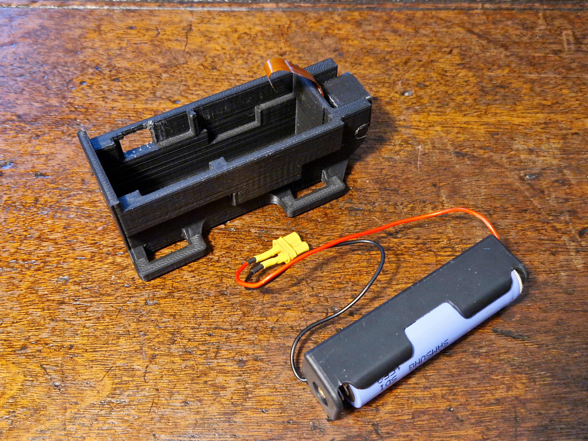
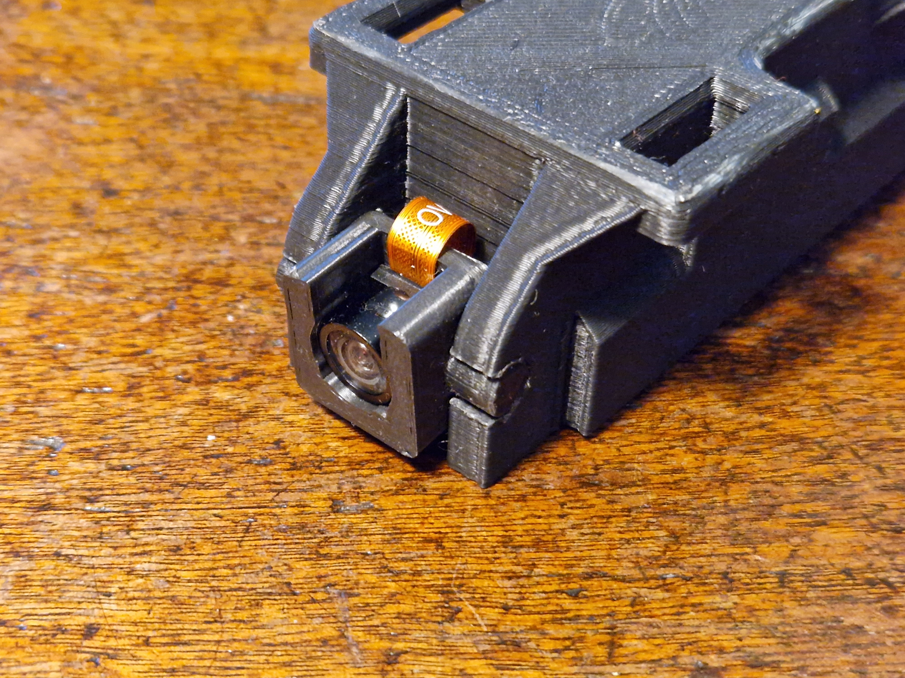

# RAT-TinyML-record
 RAT TinyML backpack code. recording only
 
 This is the code for the Syntiant TinyML board
 
 The base code for logging accelerometer data has been modified to communicate with an ESP32 over the 2nd serial port (pins 6 and 7). The TinyMl can communicate messages to the ESP32 which will then be forwarded to the user on the viewing webpage
 Whenever the ESP32 receives a time update(either from NPT server or the browser) it sends a message to the TinyML to update the RTC so that both systems will end up with synchronously time stamped log files.

6 pin connections betwixt ESP32 and TinyML board. (Dupont 3x2 connector, pins on ESP32 side) 
_|_  
---|---
5V (Brown)|Tx (White)
3V3 (Red)|Rx (Yellow)
IO0 (Green)|GND (Black)

5V and IO0 are used for programming. 3V3 is used in the backpack and takes power from the 3V3 test pad on the TinyML.

Battery is an 18650 in a holder. A smaller cell would make everything smaller and lighter, this is what was to hand. Battery connector is an Amass XT30.

Camera is an OV2640 wide andgle on a 75mm flexi.

ESP32 source code repository: https://github.com/binraker/RAT-ESP32

CAD for case: https://gallery.autodesk.com/projects/169803/camerawifiai-platform

To get the data from the sensor we need to load a model into the AI processor. To do this, simply copy the file [sensor_data_collection_model.bin](sensor_data_collection_model/sensor_data_collection_model.bin) from the `sensor_data_collection_model` folder onto the SD card that you put into the Syntiant TinyML board and it will read it on power up. Also, copy the contents of the folder [copy_this_folder_contents_to_SD_card](copy_this_folder_contents_to_SD_card/) to the SD card. The SD card should therefore have the `config` folder and `sensor_data_collection_model.bin` file as shown in the image below:


The next step is to gather some data and train the ML model. The Syntiant TinyML will then generate a message when it detects something in the accelerometer data-stream that looks like an action we have labelled

# Building one:
Bits that are needed:

Item|Manufacturer|Example listing
---|---|---
ESP32 CAM |AI Thinker
u.FL to SMA cable|
SMA 2.4GHz antenna| | https://tinyurl.com/RatPackKit
OV2640 wide   on a 75mm| | https://tinyurl.com/75mmOV2640
TinyML |Syntiant | https://tinyurl.com/TinyMLDigikey
18650 Li-ion Cell|
186050 holder|
1mm JST 2 pin connector|
XT30 connector pair| Amass
2x3 DuPont connector pair and pins |DuPont | https://tinyurl.com/2by3connector
USB to Serial adaptor (for ESP32 programming) | SparkFun | https://tinyurl.com/serialbreakout

Images of the hardware








# New updates

- The Syntiant board and ESP32CAM are now synced. The ESP32CAM fetches the time and gives it to the Syntiant board which then starts the on-board RTC. If no time is found, there is a variable with a manually defined time variable, `manual_set_start_time`, which the Syntiant board will start counting from.
- The CSV files created by the Syntiant board now look like the example below. They are now more visually understandable and also [Edge Impulse](https://edgeimpulse.com/) CSV "compliant". The image below shows a CSV sample that has been uploaded to an Edge Impulse project.

| timestamp |   accX    |   accY    |   accZ    |   gyrX    |   gyrY    |   gyrZ |
| --------  | --------- | --------- | --------- | --------- | --------- | ------ |
| 0	        |  -8925	|   767	    |   -3749	|   8957	|   -2989	|   19737|
|   115	    |   -8588	|   387	    |   -3654	|   8680	|   -3118	|   19802|
|   115	    |   -8036	|   -478	|   -4258	|   8326	|   -3174	|   19837|


- Once the Syntiant board starts saving IMU data, it first communicates to the ESP32CAM and gives it a file name. The ESP32CAM then saves the AVI file using this file name. There is a config file, in the Syntiant's SD card, which keeps the count of how many files have been saved and this is used when creating new files. 

- The CSV IMU files are now saved in the format below: 
```
  IMUData_1_2023_11_10_16_56_00
  that is, IMUData, file count(epoch), Year, Month, Date, Hr, Min, Seconds
```

- The AVI recordings are now captured for 10 seconds at 10 frames per second (fps) and using SVGA frame size. Example:
```
  IMUSyncedVideo_1_2023_11_10_16_56_00.avi
```

- The Syntiant TinyML Board's RGB LED is blue when IMU data is being sampled. The RGB LED turns green when IMU data is not being sampled.

# Performance (storage and power consumption)

## Stored file sizes

- The Syntiant TinyML Board continuously saves 10 seconds of IMU data in CSV files that are around 40KB. Afterwards, it waits for 2 seconds and the sampling is done again. Therefore, in 1 minute, 5 cycles will have run generating files of around 200KB. `Therefore, as an estimation, if you use a 4GB SD card in the Syntiant TinyML board, it will take around 300 hours for the SD card storage to be filled; assuming there are no other files other than the project ones.`

- The ESP32CAM saved AVI files are initiated by the Syntiant TinyML Board. Each AVI file is around 2,300 KB. Therefore, in 1 minute, 5 cycles will have run generating files of around 11,500 KB. `Therefore, as an estimation, if you use a 4GB SD card in the ESP32CAM board, it will take around 5 hours for the SD card storage to be filled: assuming there are no other files other than the project ones.`

## Power consumption
